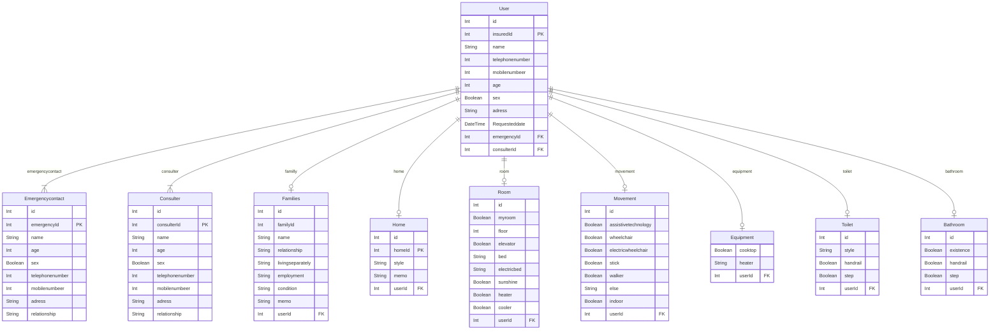
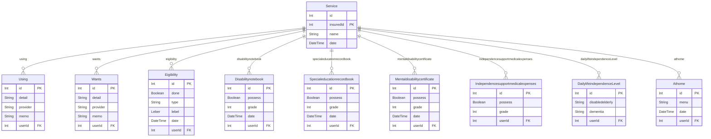

```mermaid
erDiagram
    User {
        Int id
        Int insuredId PK
        String name
        Int telephonenumber
        Int mobilenumbeer
        Int age
        Boolean sex
        String adress
        DateTime Requesteddate
        Int emergencyId FK
        Int consulterId FK
    }

    Emergencycontact {
      Int id
      Int emergencyId PK
      String name
      Int age
      Boolean sex
      Int telephonenumber
      Int mobilenumbeer
      String adress
      String relationship
    }

    Consulter {
      Int id
      Int consulterId PK
      String name
      Int age
      Boolean sex
      Int telephonenumber
      Int mobilenumbeer
      String adress
      String relationship
    }

    Families {
      Int id
      Int familyId
      String name
      String relationship
      String livingseparately
      String employment
      String condition
      String memo
      Int userId FK
    }

    Home {
      Int id
      Int homeId PK
      String style
      String memo
      Int userId FK
    }

    Room {
      Int id
      Boolean myroom
      Int floor
      Boolean elevator
      String bed
      String electricbed
      Boolean sunshine
      Boolean heater
      Boolean cooler
      Int userId FK
    }

    Movement {
      Int id
      Boolean assistivetechnology
      Boolean wheelchair
      Boolean electricwheelchair
      Boolean stick
      Boolean walker
      String else
      Boolean indoor
      Int userId FK
    }

    Equipment {
      Boolean cooktop
      String heater
      Int userId FK
    }

    Toilet {
      Int id
      String style
      Boolean handrail
      Boolean step
      Int userId FK
    }

    Bathroom {
      Int id
      Boolean existence
      Boolean handrail
      Boolean step
      Int userId FK
    }
    %% Relationships
    User ||--|{ Emergencycontact : "emergencycontact"
    User ||--|{ Consulter : "consulter"
    User ||--o| Families : "familly"
    User ||--o| Home : "home"
    User ||--o| Room : "room"
    User ||--o| Movement : "movement"
    User ||--o| Equipment : "equipment"
    User ||--o| Toilet : "toilet"
    User ||--o| Bathroom : "bathroom"
```

```mermaid
erDiagram
    Service {
      Int id
      Int insuredId PK
      String name
      DateTime date
    }

    Using {
      Int id PK
      String detail
      String provider
      String memo
      Int userId FK
    }

    Wants {
      Int id PK
      String detail
      String provider
      String memo
      Int userId FK
    }

    Eigibility {
      Int id PK
      Boolean done
      String type
      Leber lebel
      DateTime date
      Int userId FK
    }

    Disabilitynotebook {
      Int id PK
      Boolean possess
      Int grade
      DateTime date
      Int userId FK
    }

    Specialeducationrecordbook {
      Int id PK
      Boolean possess
      Int grade
      DateTime date
      Int userId FK
    }

    Mentaldisabilitycertificate {
      Int id PK
      Boolean possess
      Int grade
      DateTime date
      Int userId FK
    }

    Independencesupportmedicalexpenses {
      Int id PK
      Boolean possess
      Int grade
      Int userId FK
    }

    DailylifeindependenceLevel {
      Int id PK
      String disabledelderly
      String dementia
      Int userId FK
    }

    Athome {
      Int id PK
      String menu
      DateTime date
      Int userId FK
    }

    %% Relationships
    Service ||--o{ Using : "using"
    Service ||--o{ Wants : "wants"
    Service ||--o{ Eigibility : "eigibility"
    Service ||--o{ Disabilitynotebook : "disabilitynotebook"
    Service ||--o{ Specialeducationrecordbook : "specialeducationrecordbook"
    Service ||--o{ Mentaldisabilitycertificate : "mentaldisabilitycertificate"
    Service ||--o{ Independencesupportmedicalexpenses : "independencesupportmedicalexpenses"
    Service ||--o{ DailylifeindependenceLevel : "dailylifeindependenceLevel"
    Service ||--o{ Athome : "athome"
```
